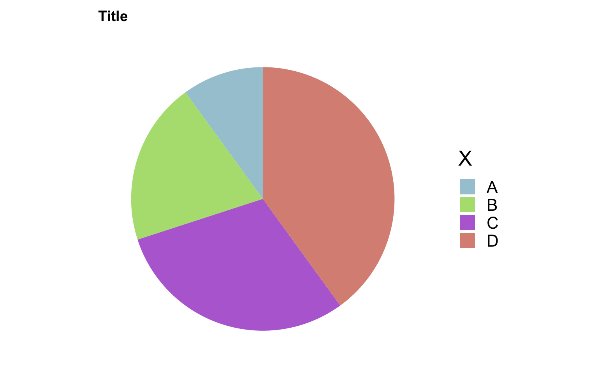

## 用ggplot2做饼图（Pie plot）

``` r
library(tidyverse)
```

    ── Attaching core tidyverse packages ──────────────────────── tidyverse 2.0.0 ──
    ✔ dplyr     1.2.1     ✔ readr     2.2.0
    ✔ forcats   1.0.1     ✔ stringr   1.6.0
    ✔ ggplot2   4.0.3     ✔ tibble    3.3.1
    ✔ lubridate 1.9.5     ✔ tidyr     1.3.2
    ✔ purrr     1.2.2     
    ── Conflicts ────────────────────────────────────────── tidyverse_conflicts() ──
    ✖ dplyr::filter() masks stats::filter()
    ✖ dplyr::lag()    masks stats::lag()
    ℹ Use the conflicted package (<http://conflicted.r-lib.org/>) to force all conflicts to become errors

``` r
dat <- tibble(y = c(1, 2, 3, 4), x = c('A', 'B', 'C', 'D'), color = c("#A6C9D5", "#B3DF7F", "#B76ED5", "#DA9083"))
dat
```

    # A tibble: 4 × 3
          y x     color  
      <dbl> <chr> <chr>  
    1     1 A     #A6C9D5
    2     2 B     #B3DF7F
    3     3 C     #B76ED5
    4     4 D     #DA9083

``` r
dat %>% 
  # 让四种类型堆叠在一起，用不同的颜色填充
  ggplot(aes(x = '', y = y, fill = x)) + 
  geom_bar(width = 1, stat = 'identity') +
  coord_polar("y", start = 0) +
  labs(fill = 'X', title = 'Title') +
  scale_fill_manual(values = dat$color) +
  theme_minimal(base_size = 20) +
  theme(
    axis.title.x = element_blank(),
    axis.title.y = element_blank(),
    panel.border = element_blank(),
    panel.grid = element_blank(),
    axis.ticks = element_blank(),
    plot.title = element_text(size = 14, face = 'bold'),
    axis.text.x = element_blank(),
    legend.position = 'right'
  )
```



``` r
# 输出图片的大小
# ggsave('filepath.pdf', width = 14, height = 8)
```

## 修改.label.gii文件的颜色

``` python
import nibabel as nib
import matplotlib as mpl

lhGiiPath = 'xxx.label.gii'
lhGii = nib.load(lhGiiPath)
lhGii.labeltable.labels[0].rgba = mpl.colors.to_rgba('#ABCD11FF')
nib.save(lhGii, 'new_xxx.label.gii')
```

其中label.gii文件中的颜色信息可以通过lhGii.labeltable.labels返回；通过对其赋值可以修改对应的颜色；
