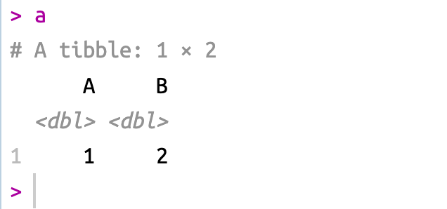

## Add a new row into a empty tibble in R

There is a simple example below.

``` r
library(tidyverse)

a <- tibble()
a <- a %>%
  bind_rows(list(A = 1, B = 2))
```

This is the results:

<figure>

<figcaption aria-hidden="true">A simple example</figcaption>
</figure>
